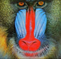

# LIIF-PyTorch

## Overview

This repository contains an op-for-op PyTorch reimplementation
of [Learning Continuous Image Representation with Local Implicit Image Function](https://arxiv.org/pdf/2012.09161v2.pdf)
.

## Table of contents

- [LIIF-PyTorch](#liif-pytorch)
    - [Overview](#overview)
    - [Table of contents](#table-of-contents)
    - [Download weights](#download-weights)
    - [Download datasets](#download-datasets)
    - [How Test and Train](#how-test-and-train)
        - [Test](#test)
        - [Train LIIF model](#train-liif-model)
        - [Resume train LIIF model](#resume-train-liif-model)
    - [Result](#result)
    - [Contributing](#contributing)
    - [Credit](#credit)
        - [Learning Continuous Image Representation with Local Implicit Image Function](#learning-continuous-image-representation-with-local-implicit-image-function)

## Download weights

- [Google Driver](https://drive.google.com/drive/folders/17ju2HN7Y6pyPK2CC_AqnAfTOe9_3hCQ8?usp=sharing)
- [Baidu Driver](https://pan.baidu.com/s/1yNs4rqIb004-NKEdKBJtYg?pwd=llot)

## Download datasets

Contains DIV2K, DIV8K, Flickr2K, OST, T91, Set5, Set14, BSDS100 and BSDS200, etc.

- [Google Driver](https://drive.google.com/drive/folders/1A6lzGeQrFMxPqJehK9s37ce-tPDj20mD?usp=sharing)
- [Baidu Driver](https://pan.baidu.com/s/1o-8Ty_7q6DiS3ykLU09IVg?pwd=llot)

Please refer to `README.md` in the `data` directory for the method of making a dataset.

## How Test and Train

Both training and testing only need to modify the `config.py` file.

### Test

modify the `config.py`

- line 31: `model_arch_name` change to `liif_edsr`.
- line 36: `upscale_factor` change to `4`.
- line 38: `mode` change to `test`.
- line 88: `model_weights_path` change to `./results/pretrained_models/LIIF_EDSR_x4-DIV2K-cc1955cd.pth.tar`.
-

```bash
python3 test.py
```

### Train LIIF model

modify the `config.py`

- line 31: `model_arch_name` change to `liif_edsr`.
- line 36: `upscale_factor` change to `4`.
- line 38: `mode` change to `train`.

```bash
python3 train.py
```

### Resume train LIIF model

modify the `liif.py`

- line 31: `model_arch_name` change to `liif_edsr`.
- line 36: `upscale_factor` change to `4`.
- line 38: `mode` change to `train`.
- line 57: `resume_model_weights_path` change to `./results/LIIF_EDSR-DIV2K/epoch_xxx.pth.tar`.

```bash
python3 train.py
```

## Result

Source of original paper results: [https://arxiv.org/pdf/2012.09161v2.pdf](https://arxiv.org/pdf/2012.09161v2.pdf)

In the following table, the psnr value in `()` indicates the result of the project, and `-` indicates no test.

|  Method   | Scale |      Set5 (PSNR/SSIM)      |     Set14 (PSNR/SSIM)      | 
|:---------:|:-----:|:--------------------------:|:--------------------------:|
| LIIF_EDSR |   4   | -(**32.15**)/-(**0.8955**) | -(**28.46**)/-(**0.7807**) | 

```bash
# Download `LIIF_EDSR_x4-DIV2K-cc1955cd.pth.tar.pth.tar` weights to `./results/pretrained_models`
# More detail see `README.md<Download weights>`
python3 ./inference.py
```

Input:

<span align="center"></span>

Output:

<span align="center"></span>

```text
Build `liif_edsr` model successfully.
Load `liif_edsr` model weights `./results/pretrained_models/LIIF_EDSR_x4-DIV2K-cc1955cd.pth.tar` successfully.
SR image save to `./figure/baboon_lr.png`
```

## Contributing

If you find a bug, create a GitHub issue, or even better, submit a pull request. Similarly, if you have questions,
simply post them as GitHub issues.

I look forward to seeing what the community does with these models!

## Credit

### Learning Continuous Image Representation with Local Implicit Image Function

_Yinbo Chen, Sifei Liu, Xiaolong Wang_ <br>

**Abstract** <br>
How to represent an image? While the visual world is presented in a continuous manner, machines store and see the images
in a discrete way with 2D arrays of pixels. In this paper, we seek to learn a continuous representation for images.
Inspired by the recent progress in 3D reconstruction with implicit neural representation, we propose Local Implicit
Image Function (LIIF), which takes an image coordinate and the 2D deep features around the coordinate as inputs,
predicts the RGB value at a given coordinate as an output. Since the coordinates are continuous, LIIF can be presented
in arbitrary resolution. To generate the continuous representation for images, we train an encoder with LIIF
representation via a self-supervised task with super-resolution. The learned continuous representation can be presented
in arbitrary resolution even extrapolate to x30 higher resolution, where the training tasks are not provided. We further
show that LIIF representation builds a bridge between discrete and continuous representation in 2D, it naturally
supports the learning tasks with size-varied image ground-truths and significantly outperforms the method with resizing
the ground-truths.

[[Paper]](https://arxiv.org/pdf/2012.09161v2.pdf) [[Code]](https://github.com/yinboc/liif)

```bibtex
@inproceedings{chen2021learning,
  title={Learning continuous image representation with local implicit image function},
  author={Chen, Yinbo and Liu, Sifei and Wang, Xiaolong},
  booktitle={Proceedings of the IEEE/CVF Conference on Computer Vision and Pattern Recognition},
  pages={8628--8638},
  year={2021}
}
```
